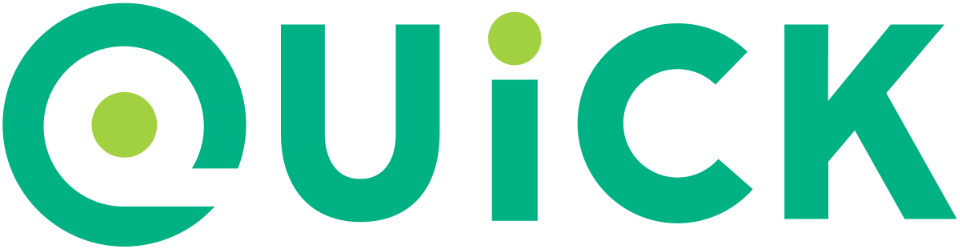

# Demo Swift Quick Nimble 

This demonstration shows:

 * The [Swift](http://swift.org) programming language with
    [Apple](http://apple.com)
    [iOS](http://www.apple.com/ios/)
    [Xcode](https://developer.apple.com/xcode/)

  * The [Quick](github.com/quick/quick) behavior-driven development framework.

  * The [Nimble](github.com/quick/nimble) matcher framework also for also both languages.

We use Quick and Nimble for [Test Driven Development (TDD)](https://en.wikipedia.org/wiki/Test-driven_development)

Quick and Nimble are inspired by RSpec, Specta, and Ginkgo.

This README describes how to create the project, if you want to try doing it yourself.

## How to create the project

1. Launch Xcode and create a new project. We call ours "Demo Swift Quick Nimble".

  * Need help? See our repo [demo_swift_hello_world](https://github.com/joelparkerhenderson/demo_swift_hello_world).

## Add Quick and Nimble

1. Add Quick and Nimble to the project.

  * To add these as a dependency, we prefer using Carthage.

  * If you prefer, you can add it by using a dynamic framework or using Cocoapods.

  * Need help with Carthage? See our repo [demo_swift_carthage](https://github.com/joelparkerhenderson/demo_swift_carthage).

1. The Carthage `Cartfile` is:

        github "Quick/Quick"
        github "Quick/Nimble"

1. The Carthage setup has two areas that are specific to the test target.

  * Be sure to create the `Run Phase` in the test target, and not in the main application target.

  * In the test target `Build Phases`, edit the section `Link Binary With Libraries`, and add the Quick framework and Nimble framework.

## Create a test

1. The project automatically creates two test folders and files.

  * Demo Swift Quick NimbleTests/Demo Swift Quick NimbleTests.swift
  * Demo Swift Quick NimbleUITests/Demo Swift Quick NimbleUITests.swift

1. Edit the first file and create a test.

        import Quick
        import Nimble

        class DemoSpec: QuickSpec {
          override func spec() {
            describe("Demo") {
              it("runs") {
                expect(true).to(beTruthy())
              }
            }
          }
        }

## Run the test

1. To run the test, choose the menu Product → Test.

  * The simulator launches.

  * You see a popup that says "Test Succeeded".

1. If you use the editor to view the file "Demo Swift Quick NimbleTests.swift", then you see a green diamond check box, which confirms the test ran and succeeded.

1. If you get the error "No such module 'Quick'" then you may need to delete derived data.

  * To delete derived data by using the command line:

          rm -rf ~/Library/Developer/Xcode/DerivedData

  * To delete derived data by using the Xcode GUI: Window → Projects → See the "Derived Data" line → click the button "Delete..."

## Protip: Make them private

This protip is thanks to the [mokacoding Carthage tutorial](http://www.mokacoding.com/blog/setting-up-testing-libraries-with-carthage-xcode7/) 

The Carthage docs say: Frameworks that want to include dependencies via Carthage, but do not want to force those dependencies on parent projects, can list them in the optional Cartfile.private file, identically to how they would be specified in the main Cartfile.

So we do this:

    mv Cartfile Cartfile.private
    carthage update

## Tracking

* Package: demo_swift_quick_nimble
* Version: 1.0.0
* Created: 2016-04-09
* Updated: 2016-08-25
* License: BSD, GPL, MIT
* Contact: Joel Parker Henderson (joel@joelparkerhenderson.com)
